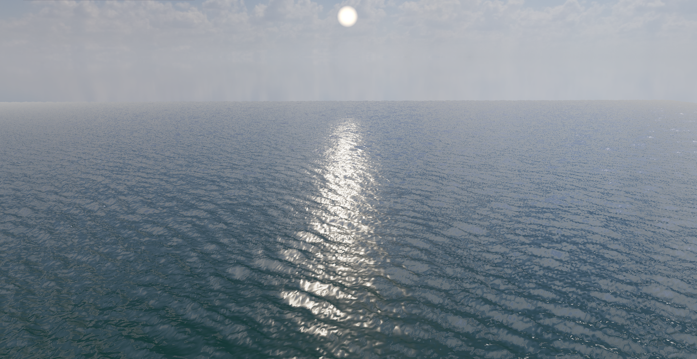
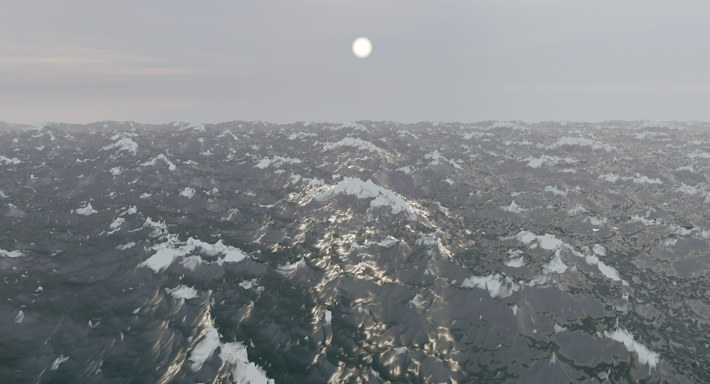
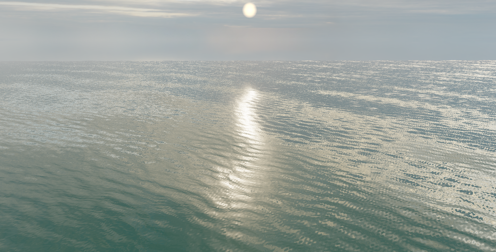
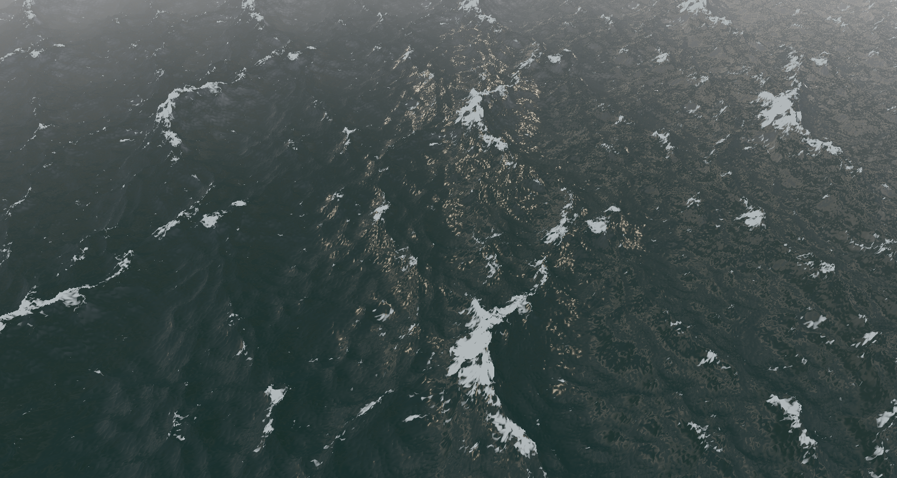

## A real time physically based ocean simulation and renderer

~50fps at 256x256x3 on an intel integrated iris xe gpu

- you need to download a hdri and store it at assets/<hdri_name>.exr
- currently defaulting to "kloofendal.exr"
- default hdri can be changed in src/renderer.rs ~line 42
https://polyhaven.com/a/kloofendal_43d_clear_puresky

[demo](./assets/demo.mp4)
[Report](paperwork.pdf)

## Previews

